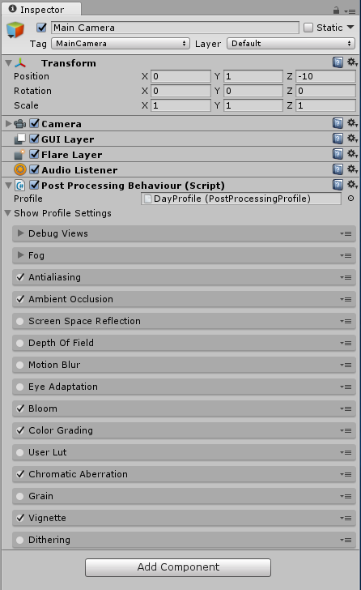

# Unity-PostProcessingEditor
Directly show the profile setting under the PostProcessingBehaviour component.

## Usge:
Replace this with the original PostProcessingBehaviourEditor.cs file.
(Located: Asset/PostProcessing/Editor)

